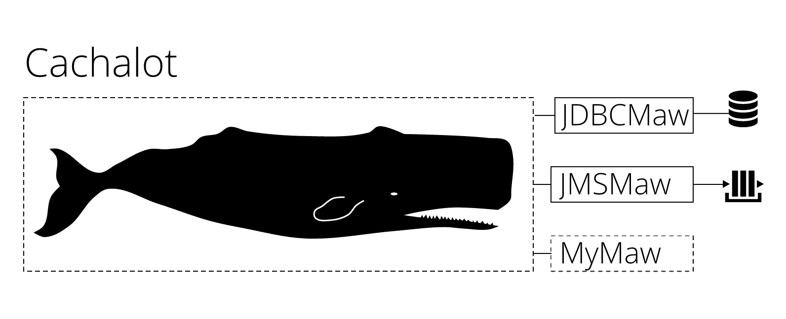

# Cachalot - a Java acceptance testing framework for complex backends
Cachalot is a testing framework created for backend-heavy spring-based Java applications.
Frequently, the only way to test complex server-side logic is via remote calls through JMS, or some other protocol. This is the situation Cachalot was designed for.
 

                                                                                                                             
 
 
## How to feed 

 * Inherit and Override:  

```java
class MyAwesomeScenario extends ru.cinimex.cachalot.Cachalot {
    @Override
    protected void feed() throws Exception {
    }
}
```

 * Use dsl inside feed to describe your scenario (it's a bit like Camel):  

```java
class MyAwesomeScenario extends ru.cinimex.cachalot.Cachalot {
    
    @Override
    protected void feed() throws Exception {
        
        enableDataTrace()
            .usingJms(factory)
                .waitNotMoreThen(7000)
                .withRavage()
                .sendTo("INPUT_QUEUE")
                    .withSpecifiedInput("<Message></Message>")
                .ingest()    
                .receiveFrom("OUTPUT_QUEUE")
                    .withExpectedResponse("<Message><Transformed/></Message>")
                    .addRule(s -> !s.isEmpty())
                .ingest()
            .ingest()    
            .usingJdbc(dataSource)
                .beforeFeed(() -> "TRUNCATE MY_TABLE CASCADE")
                .afterFeed(new JdbcValidationRule<>(myMapper, Objects::nonNull, "SELECT * FROM RESULT_TABLE"))
            .ingest();
    }
}
```
        
 <h5>It's done.</h5>
 
 <h4>Dsl meaning:</h4>
 
* enableDataTrace()  
    
        Local logs will contain all information about configuration and processing.
        The output can be quite complex.   
* withRavage()  
    
        All messages from specified in/out queues will be cleared before jms subsystem run.           
* usingJms(ConnectionFactory factory)

        Indicates, that your test use jms as underlying system. Method accepts 
        {@link javax.jms.ConnectionFactory} as input and opens different scope of 
        jms related api calls.
* sendTo(String inQueue)  
         
        Target queue to send message.
* withSpecifiedInput(String message)   
         
        Message to send. It could be any string text.
* receiveFrom(String outQueue)  
         
        Message queue to receive message from. This queue will be added to response queue collection.
        By default assumed, that each queue produce one message. I.e. if you want to receive multiple messages
        from one queue, you can call this method multiple times, or call #receiveFrom(Collection<String> outQueues).
        This method call is not idempotent: it's changing state of underlying infrastructure.
* withExpectedResponse(String message)
         
        If provided, received messages will be compared with the body. If it won't be found, test will be considered
        as failed.
* withExpectedResponse(Collection<String> messages)
        
        Same as #withExpectedResponse(String message), but all messages will be compared with responses.
* waitNotMoreThen(long millis)  
        
        Timeout for each output queue to process.
* withoutResponse()  
        
        Indicates in-only interaction. Test flow won't be waiting for response.
* withHeader(String header, Object value)  
        
        Append header to jms message.
* withHeaders(Map<String, ?> headers)  
        
        Append headers to jms message.
* ingest()  

        Complete the subsystem (jms or jdbc or any...) configuration and returns to main config.
* usingJdbc(DataSource dataSource)  
       
        Indicates, that your test use database for manipulating data before/after execution.
* beforeFeed(Supplier<? extends String> initializer)  
       
        Initializer will be used before test execution for initial state manipulating.
        It could be implemented as simple lambda: () -> "UPDATE MY_TABLE SET PROPERTY = 'AB' WHERE PROPERTY = 'BA'".
        This method is not idempotent, i.e. each call will add statement to execute.
* beforeFeed(Collection<Supplier<? extends String>> initializers)  
         
        Same as #beforeFeed(Supplier<? extends String> initializer), but for multiple statements.
* afterFeed(JdbcValidationRule<?> verificator)  

        Validate database state after test run.
        This method is not idempotent, i.e. each call will add a rule to validate.
        It rule validation fail, then test will be considered as failed.
* afterFeed(Collection<JdbcValidationRule<?>> verificators)  
        
        Same as #afterFeed(JdbcValidationRule<?> verificator), but for multiple predicates at once.
          
          
Note: you can change execution order of any subsystem with order:

```java
class MyAwesomeScenario extends ru.cinimex.cachalot.Cachalot {
    @Override
    protected void feed() throws Exception {
        usingJdbc(datasource)
            .withStartPriority(12) // priority of initial step
            .withEndPriority(99) // priority of completion step
            .beforeFeed(() -> "UPDATE XXX")
        .ingest();    
    }
}
```

Priority could be any number in [0, 100].
Subsystem with highest priority will execute first.
